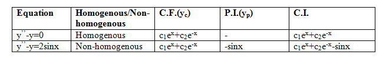

It is well known that linear ordinary differential equations with constant coefficients are used in solving engineering problems. This experiment will help in building a clear understanding of the mathematical ideas behind the standard method of finding solutions of these equations.

**1. Notation:**

(i.) <i>E</i>: collection of differentiable function  
(ii.) <i>F</i>: function from <i>R</i> to <i>R</i>  
(iii.) <i>D</i>: <i>d</i>/<i>dx</i>  
(iv.) <i>D</i>2: <i>d</i>/<i>dx</i>(<i>d</i>/<i>dx</i>) i.e. <i>d</i>2/<i>dx</i>2 
 
This experiment is not focused on learning the standard method of solution.

**2. Second order linear differential equation:**

The equation  
<i>y</i>’’+<i>Py</i>’+<i>Qy</i>=<i>f</i>(<i>x</i>) 					…(i)  
is a second order linear differential equation with constant coefficients, where <i>P, Q</i>&isin;<i>R</i> and <i>f</i>:<i>R</i>→<i>R</i> is a continuous function. If <i>f</i>(<i>x</i>)=0, then such equation is called a homogeneous second order linear differential equation with constant coefficients.
It is well known that linear ordinary differential equations with constant coefficients are used in solving engineering problems.

**3. Standard method of solution:**

In this section, we present the standard method to obtain the solution of equation (i). 
  
Consider the equation <i>am</i>2+<i>bm</i>+<i>c</i>=0, which is called the auxiliary equation. Then <i>y</i>(<i>x</i>) = <i>c</i>1<i>e</i><i>m</i>1<i>x</i>+<i>c</i>2<i>e</i><i>m</i>2<i>x</i>, where <i>c</i>1, <i>c</i>2 are constants and <i>m</i>1, <i>m</i>2 are the roots of the auxiliary equation is known as complementary function (C.F.) and is denoted by <i>y</i><i>c</i>.   
A specific function <i>g</i>(<i>x</i>) which satisfies equation (<i>i</i>) is called particular integral (P.I.) and is denoted by <i>y</i><i>p</i>. Any solution of equation (<i>i</i>) is of the form <i>y</i>(<i>x</i>)≡<i>y</i><i>c</i>+<i>y</i><i>p</i>=<i>c</i>1<i>e</i><i>m</i>1<i>x</i>+<i>c</i>2<i>e</i><i>m</i>2<i>x</i>+<i>g</i>(<i>x</i>). This is called the complete integral (C.I.).   
In particular, if <i>f</i>(<i>x</i>)=0, then complementary function gives all solutions of equation (<i>i</i>), so that C.I.=C.F, that is its solution is given by <i>y</i>(<i>x</i>) = <i>c</i>1<i>e</i><i>m</i>1<i>x</i>+<i>c</i>2<i>e</i><i>m</i>2<i>x</i>, where  <i>c</i>1, <i>c</i>2 are constants and  <i>m</i>1, <i>m</i>2 are the roots of the auxiliary equation <i>am</i>2+<i>bm</i>+<i>c</i>=0   
<b>Note.</b> There are typical approaches for calculating particular integral, but here we will consider hit and trial approach only. 

**4. Examples and explanation matrix:** 
**4.1. Examples:**

(i.) Let <i>y</i>’’-<i>y</i>=0 be a homogeneous second order linear differential equation. Then <i>y</i>’’=<i>D</i>2(<i>y</i>), which implies that (<i>D</i>2-<i>I</i>)<i>y</i>=0. Clearly auxiliary equation is <i>m</i>2-1=0, thus <i>m</i>=1, -1. Then the complementary function and hence the complete integral of this equation is <i>c</i>1<i>e</i><i>x</i>+<i>c</i>2<i>e</i>-<i>x</i>, where <i>c</i>1, <i>c</i>2 are constants.
 
(ii.) Let <i>y</i>’’-<i>y</i>=2sin<i>x</i> be the second order linear differential equation. Let <i>y</i>’’=<i>D</i>2(<i>y</i>). Then (<i>D</i>2-1)<i>y</i>=2sin<i>x</i>, <i>y</i>=-sin<i>x</i> satisfies this equation. It can be seen that -sin<i>x</i> is a particular integral of this equation. Thus complete integral is <i>C</i>1<i>e</i><i>x</i>+<i>C</i>2<i>e</i>-<i>x</i> -sin<i>x</i>, where <i>c</i>1, <i>c</i>2 are constants.

**4.2 Summary:**

Examples given in Section 4.1 are summarized in explanation matrix given below.

**5. Understanding:**  
**5.1. Collection of differentiable functions as a vector space:**

Collection of differentiable functions <i>E</i> from <i>R</i> to <i>R</i> is a vector space over <i>R</i> with addition and scalar multiplication of functions.

**5.2. Derivative as an operator:**

Notion of derivative is well known. It operates on functions. Thus <i>d</i>/<i>dx</i> is a function from the collection of differentiable functions to collection of functions. It is denoted by <i>D</i> and is called differential operator.

**5.3. Operator defined by differential equation:**

Let <i>y</i>’’+<i>py</i>’+<i>qy</i>=<i>f</i>(<i>x</i>), where <i>p, q</i>&isin;<i>R</i> be a given linear differential equation of second order. Then (<i>D</i>2+<i>pD</i>+<i>qI</i>)(<i>y</i>)=<i>r</i>, where <i>D</i>2(<i>y</i>)= <i>y</i>’’, <i>D</i>(<i>y</i>)=<i>y</i>’ and <i>I</i> is the identity operator. Thus the L.H.S. of the given equation provides the operator <i>D</i>2+<i>pD</i>+<i>qI</i> which is called the operator defined by the given differential equation.

**5.4. Linear map equation defined by a given differential equation:**

Let <i>y</i>’’+<i>py</i>’+<i>qy</i>=<i>f</i>(<i>x</i>), where <i>p, q</i>&isin;<i>R</i> be a given linear differential equation of second order. Then this can be written as <i>T</i>(<i>y</i>)=<i>r</i>, where <i>T</i>:<i>F</i>→<i>F</i> is the operator as defined in Section 5.3 so that <i>T</i>=<i>D</i>2+<i>pD</i>+<i>qI</i>. This is the desired linear map equation <i>T</i>(<i>y</i>)=<i>r</i> given by the differential equation.

**5.5. Solution of differential equation:**

Recall that solution set of a linear map <i>T</i>(<i>y</i>)=<i>r</i>, as described in Section 5.4, is <i>y</i><i>o</i>+ker<i>T</i>, where <i>y</i><i>o</i> is its particular solution and ker<i>T</i> is the collection of all solutions of <i>T</i>(<i>y</i>)=0. Notice that linear map equation is just another form of the given differential equation. Therefore its solutions are also the solution of given differential equation.

As given in Section 3, a solution of linear differential equation is given by <i>y</i><i>c</i>+<i>y</i><i>p</i>, where <i>y</i><i>c</i> is a solution of the homogenous counterpart of the given differential equation and <i>y</i><i>c</i> is a particular solution of the given differential equation. Here it may be noted that <i>y</i><i>p</i> corresponds to <i>y</i><i>o</i> and <i>y</i><i>c</i> corresponds to an element of ker<i>T</i>.

**5.6. Example: **

Let <i>y</i>’’-5<i>y</i>’+6<i>y</i>=2<i>e</i><i>x</i> be the given differential equation.  
<b>Standard method for solution:</b>  
(a) The auxiliary equation is <i>m</i>2-5<i>m</i>+6=0, i.e. (<i>m</i>-2)(<i>m</i>-3)=0. Thus <i>m</i>=2, 3. Then the complementary function of the given differential equation is c1e3x+c2e2x, where<i>c</i>1, <i>c</i>2 are constants.  
(b) Clearly <i>y</i>=<i>e</i><i>x</i> satisfies the given differential equation. Thus <i>e</i><i>x</i> is a particular integral.  
(c) Thus complete integral <i>y</i>(<i>x</i>)=<i>c</i>1<i>e</i>3<i>x</i>+<i>c</i>2<i>e</i>2<i>x</i>+<i>e</i><i>x</i>, where <i>c</i>1, <i>c</i>2 are constants.  
<b>Verification:</b>   
Substituting the value of <i>y</i>(<i>x</i>) obtained above, in the given differential equation, it comes out to be equal to 2<i>e</i><i>x</i> which is the R.H.S. of the given differential equation.  
<b>Understanding of complete integral:</b>   
This provides an illustration of the understanding provided in Section 5, i.e understanding as to why the standard method as given in Section 3 provides all solutions of the given differential equation.  
The linear map arising out of the given differential equation is <i>T</i>≡<i>D</i>2-5<i>D</i>+6<i>I</i> and the linear map equation is T(y)=2ex. The solution set of linear map equation is the solution set of the given differential equation. 

**6. Example (Engineering problem):**

In an RLC circuit, at <i>t</i>=0, a current of 2 ampere flows with resistance <i>R</i>=40 ohm, inductance <i>L</i>=2/5 henry, and capacitance <i>C</i>=10−2 farad. The current <i>I</i>≡<i>dQ</i>/<i>dt</i> is to be determined, where <i>Q</i> is the charge flowing in the circuit at <i>t</i>>0 if <i>Q</i>(0)=1, <i>Q′</i>(0)=2. It is assumed here that voltage <i>E</i>(<i>t</i>)=0, for <i>t</i>>0.   
The given problem is mathematically represented by an initial value problem: the differential equation for the charge <i>Q</i> across the circuit using Kirchhoff’s law is 2/5<i>Q′′</i>+40<i>Q′</i>+100<i>Q</i>=<i>E</i>(<i>t</i>) and the initial condition are <i>Q</i>(0)=1, <i>Q′</i>(0)=2. To find its solution and the required current, we proceed as follows.   
The given differential equation reduces to 2<i>Q′′</i>+200<i>Q′</i>+500<i>Q</i>=0. The auxiliary equation of the given differential equation is 2<i>m</i>2+200<i>m</i>+500=0. Thus <i>m</i>=130 or 70. Therefore the complete integral of the given differential equation is                                                       
                      <i>Q</i>=<i>c</i>1<i>e</i>130<i>t</i>+<i>c</i>2<i>e</i>70<i>t</i>,                      …(<i>i</i>)  
where <i>c</i>1, <i>c</i>2 are constants. Now differentiating equation (<i>i</i>) yields   
                           <i>Q′</i>=130<i>c</i>1<i>e</i>130<i>t</i>+70<i>c</i>2<i>e</i>70<i>t</i>,           … (<i>ii</i>)   
Using given initial conditions, we obtain <i>c</i>1+<i>c</i>2=<i>Q</i>(0)=1 and 130<i>c</i>1+70<i>c</i>2=<i>Q′</i>(0)=2. Therefore <i>c</i>2=128/60 and <i>c</i>1=-68/60. Thus <i>Q</i>=128/60<i>e</i>130<i>t</i>-68/60<i>e</i>70<i>t</i>. Required current <i>I</i>≡<i>dQ</i>/<i>dt</i>=130.(128/60)<i>e</i>130<i>t</i>+70.(-68/60)<i>e</i>70t.
